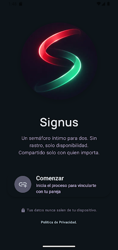

<p align="center">
  
</p>

<h1 align="center">🌐 Signus Landing</h1>

<p align="center">
  <em>Landing page de Signus — Mediación Emocional para Parejas.</em>
</p>

<p align="center">
  <a href="https://github.com/E-delSol/signus_landing/actions/workflows/deploy.yml"></a>
  
  <a href="https://e-delsol.github.io/signus_landing/"></a>
</p>

---

## 🚀 Project Summary

This is the **landing page** for Signus, an emotional mediation tool for couples.

Signus provides a shared "traffic light" style status between two partners, allowing lightweight emotional communication without the pressure of starting a complex verbal conversation when feelings are fragile.

### The Signus Ecosystem

Signus is structured as a multi-repository system:

* [signus_app](https://github.com/E-delSol/signus_app) — Android client
* [signus_back](https://github.com/E-delSol/signus_back) — Backend API (Ktor + WebSockets)
* [signus_infra](https://github.com/E-delSol/signus_infra) — Infrastructure and deployment
* **signus_landing** — Landing page (this repository)

🌐 **Live:** [e-delsol.github.io/signus_landing](https://e-delsol.github.io/signus_landing/)

---

## 🧩 What this project demonstrates

* Building a product landing page with **Vite + Tailwind CSS CLI** (no CDN)
* Applying a **Modern Editorial** design system with custom typography
* Deploying to **GitHub Pages** via GitHub Actions
* Responsive design for mobile and desktop
* Semi-standalone repository with its own design tokens and build pipeline
* **Open Graph** meta tags for social sharing

---

## 🏗️ Architecture

The landing follows a static-site generation pipeline:

```text
index.html + src/ (CSS, JS, assets)
        ↓
   Vite + Tailwind CSS
        ↓
     dist/ (optimized output)
        ↓
   GitHub Pages (deployed on push to main)
```

### Design System

The visual identity is defined in [`DESIGN.md`](DESIGN.md) and implemented via Tailwind config:

* **Colors:** Traffic-light semantic palette (green/yellow/red) optimized for a soft digital interface
* **Typography:** Manrope (headlines) + Be Vietnam Pro (body)
* **Layout:** 12-column grid, 8px base unit, generous vertical spacing

---

## 🧰 Technical Stack

* **[Vite](https://vitejs.dev/)** — Build tool and dev server
* **[Tailwind CSS](https://tailwindcss.com/)** — Utility-first CSS framework
* **[PostCSS](https://postcss.org/)** — CSS processing
* **Google Fonts** — Manrope + Be Vietnam Pro
* **GitHub Actions** — Automated deploy to GitHub Pages

---

## ▶️ Local Development

### Requirements

* Node.js 20+

### Setup

```bash
npm install
```

### Development Server

```bash
npm run dev
```

### Production Build

```bash
npm run build
```

The output is generated in `dist/`.

### Preview Build

```bash
npm run preview
```

---

## 🚀 Deploy

Automated via GitHub Actions on every push to `main`.

The workflow:

1. Checks out the code
2. Installs dependencies (`npm ci`)
3. Builds the project (`npm run build`)
4. Deploys `dist/` to GitHub Pages

See [`.github/workflows/deploy.yml`](.github/workflows/deploy.yml) for details.

---

## 📂 Project Structure

```text
signus_landing/
├── index.html              — Landing page entry point
├── package.json            — Dependencies and scripts
├── vite.config.js          — Vite configuration
├── tailwind.config.js      — Tailwind theme and design tokens
├── postcss.config.js       — PostCSS plugins
├── DESIGN.md               — Design system documentation
├── .github/
│   └── workflows/
│       └── deploy.yml      — GitHub Pages deploy workflow
└── src/
    ├── main.css            — Global styles + Tailwind directives
    ├── main.js             — Mobile menu and privacy accordion
    └── assets/
        └── images/         — App screenshots and icons (WebP)
```

---

## 📄 License

MIT License
See [LICENSE](LICENSE)

---

## 👤 Author

E-delSol
